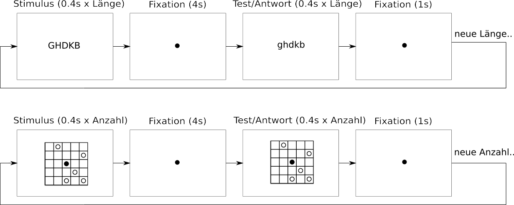
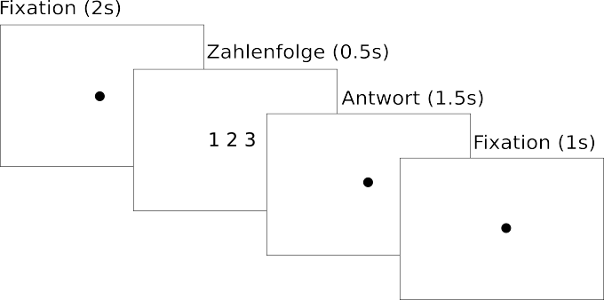
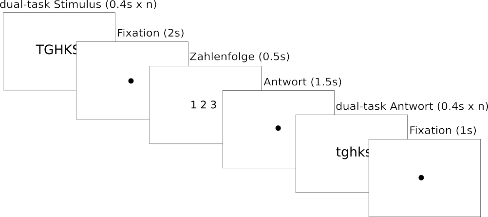
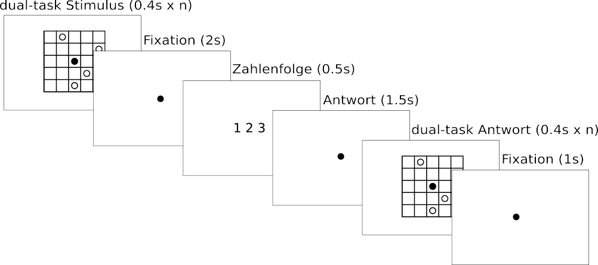
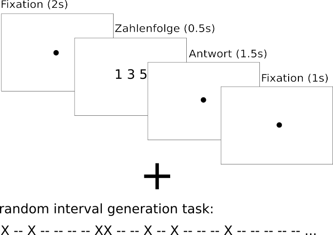

## numerical order experiment.

This psychological experiment was implemented using [PsychoJs](https://github.com/psychopy/psychojs). 
It was used in a study to investigate the reverse distance effect (Lyons et al., 2016) using a commom model of working memory (Baddeley, 2000).
Stimuli were modeled after other experiments investigating dual task performance (Cavdaroglu & Knops, 2016),(Rammelaere et al., 2003)
and numerical order processing (Vogel et al., 2017).

## Procedure.

participants are first asked to fill in their participants id. 
After that the experiment starts.

## Staircases

As the first two blocks, participants are presented with stimuli later used as dual tasks in order to determine the optimal difficulty of the stimuli
(Leek, 2001).

## Single task

After the staircase procedures, participants are presented with triplets of digits which are either ordered (ascending or descending) or not ordered.
The participants task is to react as fast as possible by pressing j or k (randomised per participant) on their keyboard to signal ordered or not ordered stimuli.

## Dual Tasks (blocks in random order)

### Phonological

Participants are presented with a stimulus meant to put a load on the phonological working memory while they solve the numerical order task.

### Visual

Participants are presented with a stimulus meant to put a load on the visual-spatial working memory while they solve the numerical order task.

### Executive

Participants are presented with a stimulus meant to put a load on the central executive working memory component while they solve the numerical order task.

### Instructions

The instructions were created using a powerpoint presentation which can be found [here](html/images).

### Literature

Baddeley, A. (2000). The episodic buffer: A new component of working memory? Trends in Cognitive Sciences, 4(11), 417–423. https://doi.org/10.1016/S1364-6613(00)01538-2

Cavdaroglu, S., & Knops, A. (2016). Mental subtraction and multiplication recruit both phonological and visuospatial resources: Evidence from a symmetric dual-task design. Psychological Research, 80(4), 608–624. https://doi.org/10.1007/s00426-015-0667-8

Leek, M. R. (2001). Adaptive procedures in psychophysical research. Perception & Psychophysics, 63(8), 1279–1292. https://doi.org/10.3758/BF03194543

Lyons, I. M., Vogel, S. E., & Ansari, D. (2016). On the ordinality of numbers. In Progress in Brain Research (Vol. 227, pp. 187–221). Elsevier. https://doi.org/10.1016/bs.pbr.2016.04.010

Rammelaere, Stijn & Vandierendonck, André. (2003). Number comparison under executive dual-task. Psychologica Belgica. 43. 259-268. 

Vogel, S. E., Haigh, T., Sommerauer, G., Spindler, M., Brunner, C., Lyons, I. M., & Grabner, R. H. (2017). Processing the Order of Symbolic Numbers: A Reliable and Unique Predictor of Arithmetic Fluency. Journal of Numerical Cognition, 3, 21.

